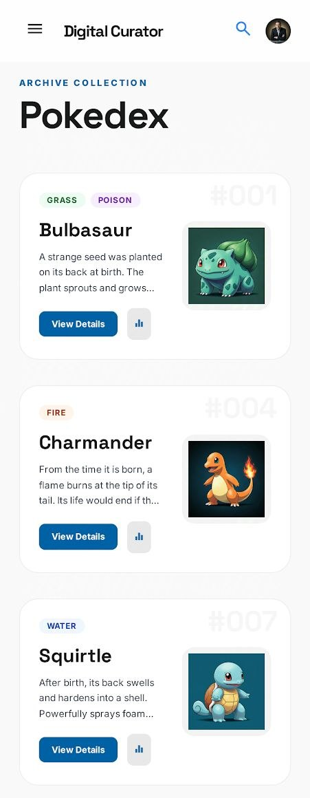
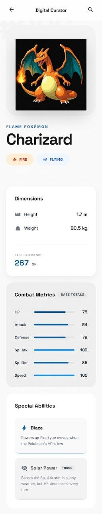

# Pokédex — Expo App 👾

A high-performance Pokédex built with [Expo](https://expo.dev) and [PokeAPI](https://pokeapi.co/), featuring infinite scrolling, debounced search, and a modern UI.

## Prerequisites

- [Node.js](https://nodejs.org/) **v18 or later**
- [Expo Go](https://expo.dev/go) app on your phone, or an Android/iOS simulator

## Get started

1. **Clone the repo and install dependencies**

   ```bash
   npm install
   ```

2. **Create a `.env` file** in the root of the project:

   ```bash
   EXPO_PUBLIC_API_URL=https://pokeapi.co/api/v2/
   ```

   > This is a public API so the value is safe to share — the file just isn't committed to keep the setup explicit.

3. **Start the app**

   ```bash
   npx expo start
   ```

   From the terminal output you can open the app in:

   - [Expo Go](https://expo.dev/go) (scan the QR code)
   - [Android emulator](https://docs.expo.dev/workflow/android-studio-emulator/)
   - [iOS simulator](https://docs.expo.dev/workflow/ios-simulator/)

---

## Screenshots

| Home Page | Pokémon Details Page |
| ------------------------------------------ | ------------------------------------------------------- |
|  |  |

---

## Features & Design Decisions

### UI
Designed in [Google Stitch](https://stitch.withgoogle.com/) for speed, then implemented with **NativeWind (Tailwind CSS for React Native)** and **React Native Paper** components.

### Home Page — Infinite Scroll
The home screen uses `FlatList` with **cursor-based pagination** to load Pokémon in batches, improving performance while keeping the experience smooth.

### Search Page — Debounced Search
Search uses a custom `useDebounce` hook (`hooks/useDebounce.tsx`) with a 400ms delay, so the filter only runs after the user stops typing — avoiding unnecessary re-renders on every keystroke.

### Data Fetching
- **[Tanstack Query v4](https://tanstack.com/query/v4)** — for server state, caching, and pagination. Chosen over RTK Query for its simplicity at this project scale.
- **[Axios v1.14.0](https://axios-http.com/)** — pinned to `1.14.0` to avoid a bug introduced in `1.14.1`.

### Tech Stack

| Library | Purpose |
|---|---|
| `expo-router` | File-based navigation |
| `@tanstack/react-query` | Data fetching & caching |
| `axios` | HTTP client |
| `nativewind` | Tailwind CSS styling |
| `react-native-paper` | UI component library |
| `expo-image` | Optimized image loading with blurhash placeholders |

---

## Project Structure

```
app/              # File-based routes (Expo Router)
  _layout.tsx     # Root layout
  index.tsx       # Home — infinite scroll list
  search.tsx      # Search with debounce
  detail.tsx      # Pokémon detail screen
api/              # API service layer (Axios + PokeAPI)
components/       # Reusable UI components
hooks/            # Custom hooks (e.g. useDebounce)
constants/        # App-wide constants
assets/           # Images, fonts, screenshots
```

---

## Learn More

- [Expo docs](https://docs.expo.dev/)
- [Expo Router](https://docs.expo.dev/router/introduction/)
- [PokeAPI](https://pokeapi.co/)
